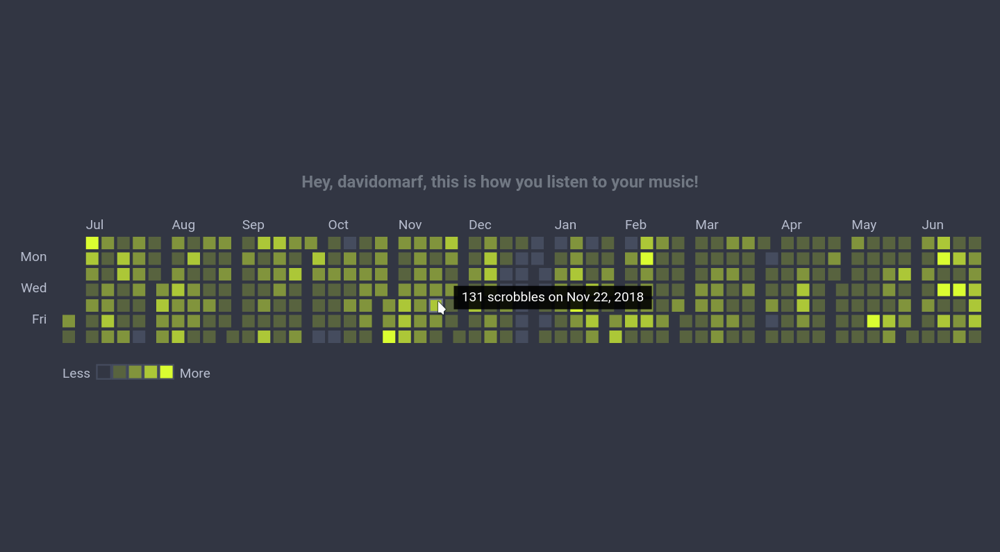

<h1 align="center">Last.fm Stats</h1>

<div align="center">
  <strong>Visualize all your Last.fm activity in a beautiful and interactive way.</strong>
  <br/>
  <a href="https://lastfmstats.herokuapp.com/">
  <i>Try Yours </i>
  </a>
</div>

<p align="center">
  
</p>


## Table of Contents

- [Features](#features)
- [Tools](#tools)
- [Installation](#installation)
- [License](#license)

## Features

**bold features** are implemented, `em features` are a work in progress,
_italic features_ are planned, but not yet in development.

### Data Visualization

- **yearly heatmap:** that shows the most and least active days, over a yearly period.
  Measured by the number of scrobbles.
  It defaults to the period of _[1 year ago, today]_.

- `yearly time series:` that shows the number of scrobbles per week, over a yearly period.
  For every week, it shows the song, artist, and album most listened to.
  It defaults to the period of _[1 year ago, today]_.

- _yearly artist time series:_ that shows the number of scrobbles from a single artist
  per week, over a yearly period.
  For every week, it shows the most listened to song.
  _Allow to switch the measurement method between scrobbles and listening time._

- _overall decades histogram:_ that shows the number of `[scrobbles, unique tracks]` for
  songs **originally** released by decade.

- _language distribution (pie?):_ that shows the languages proportion for the `[scrobbles, unique tracks]`
  in the library.

- _explicit vs. non-explicit:_ that shows the percentage of `[scrobbles, unique tracks]` with
  explicit content.

### Playlist creation

- _The `n` most listened to `[songs, artists, albums]` for every `[day, week, month, year]`,
  over `[week, month, year, overal, custom]`._

## Tools

This project is being built using [React](https://reactjs.org/), and [d3.js](https://d3js.org/)
for the visualizations.

## Installation

To use the tool, you just need to visit https://lastfmstats.herokuapp.com/

To contribute with the development you'll need a working copy of the repo in your working machine.

- You'll need to have `npm` or `yarn` installed.

- Fork the repository.

- Clone and open the directory
  ```sh
  $ git clone git@github.com:{user}/lastfm.git
  $         # https://github.com/{user}/lastfm.git
  $ cd lastfm
  ```

- Available scripts

  - `npm start` / `yarn start`
    -  Runs the app in the development mode. Open http://localhost:3000 to view it in the browser.
  - `npm test` / `yarn test`
    - Launches the test runner in the interactive watch mode.
  - `npm run build` / `yarn run build`
    - Builds the app for production to the build folder.

## License

[MIT](https://tldrlegal.com/license/mit-license)
